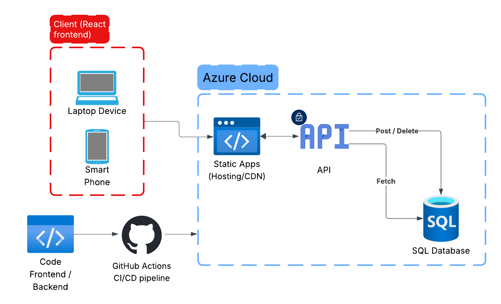

# Full-Stack Azure Web App (React + Azure Functions + SQL)

A modern full-stack application built with **React** (Vite), **Azure Functions** (Node.js), and **Azure SQL Database**. This project follows a "serverless" architecture and utilizes DevOps best practices for automated deployment.

## Architecture

To ensure scalability and security, the application is designed with the following cloud architecture:



### Components:
* **Frontend:** React application built with Vite, hosted on **Azure Static Web Apps**.
* **Backend:** Serverless API developed with **Azure Functions** (HTTP Triggers).
* **Database:** **Azure SQL Database** (Serverless tier) for persistent data storage.
* **CI/CD:** Automated deployment via **GitHub Actions**, building and deploying both frontend and backend on every push to `main`.

---

## 🚀 Features

The application supports full **CRUD** (Create, Read, Update, Delete) operations:
- [x] **Fetch:** Retrieve posts from the SQL database via API.
- [x] **Create:** Add new posts with immediate UI updates.
- [x] **Delete:** Remove existing posts using RESTful DELETE calls.
- [x] **Security:** Secure database connectivity using Azure App Settings and Environment Variables.

---

## 🛠 Tech Stack

| Area | Technology |
| :--- | :--- |
| **Frontend** | React, Vite, JavaScript, CSS |
| **Backend** | Node.js, Azure Functions |
| **Database** | Azure SQL (T-SQL) |
| **Hosting** | Azure Static Web Apps |
| **Workflow** | GitHub Actions (CI/CD) |

---

## 💻 Local Development

To run this project locally, ensure you have the [Azure Functions Core Tools](https://learn.microsoft.com/en-us/azure/azure-functions/functions-run-local) installed.

1.  **Clone the repository:**
    ```bash
    git clone [https://github.com/andreLouisK/web-database.git](https://github.com/andreLouisK/web-database.git)
    ```

2.  **Install dependencies:**
    ```bash
    npm install
    cd api
    npm install
    ```

3.  **Configure environment variables:**
    Create a `local.settings.json` file in the `api` folder with your SQL Connection String.

4.  **Run the project:**
    Use the SWA CLI to run both frontend and backend simultaneously:
    ```bash
    swa start http://localhost:5173 --api-location ./api
    ```

---